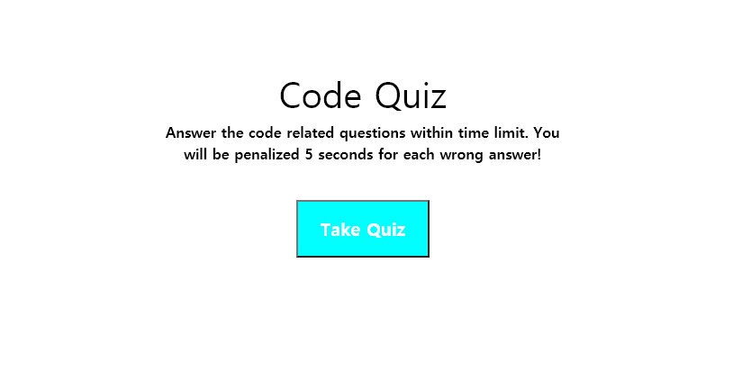
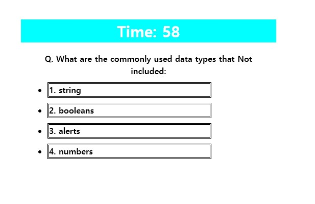
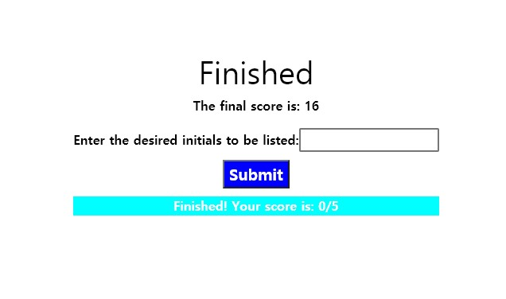
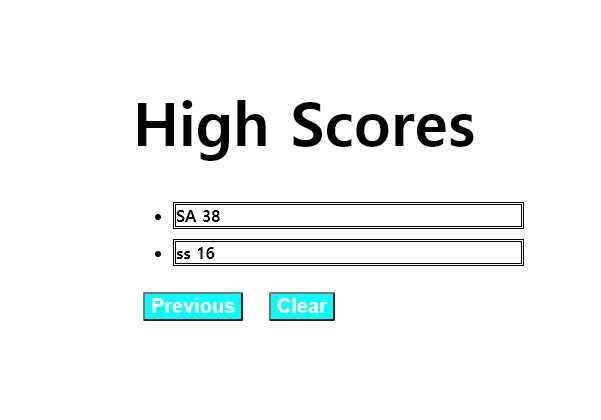

# Code Quiz
---
#### Description:
- This is a short quiz about Javascript fundamentals created with HTML/CSS and JavaScript.
---
 ## Table of Contents:
* [Features](#features)
* [Contribution](#contribution)
* [Credit](#credit)
* [License](#license)
 ---
 ## Features
 1. Click "Take Quiz" to Start!
 
 2. Pick correct choices for each question. 
 (You have total of 60 seconds to finish, each wrong answer will deduct 5 seconds off from your total time.)
 
 3. Once you finished all five questions, you will arrive at the "Finished" page. Type your desired initial to be recorded in "High Score" tab, then click "Submit".
 
 4. This is the "High Score" page, you will see listed initials of previous high scores. with "Previous" button, you will redirect to the main page. "Clear" button will clear all the listed initials in "High Score" Page.
 
---
 ## Contribution:
  ##### Thank You:
- All of my classmates from the study group, TAs, tutor and the instructor from the Georgia Tech Boot Camp.
##### Be A Contributor!
- If you would like to contribute to the open source, here is the the link: <https://github.com/ahnlok/code-quiz-homework-04>
---
## Credit:
Sungpil An <ansungpil1@gmail.com>
##### URL:
- GitPage: <https://ahnlok.github.io/code-quiz-homework-04/>
- GitHubRepository: <https://github.com/ahnlok/code-quiz-homework-04>
---
## License: 
© Sungpil An, Georgia Tech Coding Bootcamp

Licensed under the MIT License:
Copyright (c) [2020] [Sungpil An]

Permission is hereby granted, free of charge, to any person obtaining a copy of this software and associated documentation files (the "Software"), to deal in the Software without restriction, including without limitation the rights to use, copy, modify, merge, publish, distribute, sublicense, and/or sell copies of the Software, and to permit persons to whom the Software is furnished to do so, subject to the following conditions:

The above copyright notice and this permission notice shall be included in all copies or substantial portions of the Software.

THE SOFTWARE IS PROVIDED "AS IS", WITHOUT WARRANTY OF ANY KIND, EXPRESS OR IMPLIED, INCLUDING BUT NOT LIMITED TO THE WARRANTIES OF MERCHANTABILITY, FITNESS FOR A PARTICULAR PURPOSE AND NONINFRINGEMENT. IN NO EVENT SHALL THE AUTHORS OR COPYRIGHT HOLDERS BE LIABLE FOR ANY CLAIM, DAMAGES OR OTHER LIABILITY, WHETHER IN AN ACTION OF CONTRACT, TORT OR OTHERWISE, ARISING FROM, OUT OF OR IN CONNECTION WITH THE SOFTWARE OR THE USE OR OTHER DEALINGS IN THE SOFTWARE.